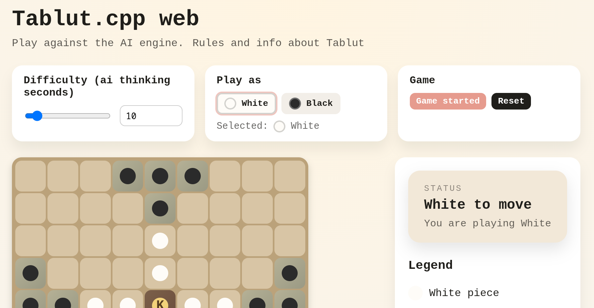

# Tablut challenge 2025 ⚔️🖳♟️

## Overview

Project for the tablut challenge, Fondamenti di intelligenza artificiale M, cds Ingegneria Informatica magistrale, University of Bologna; organized by Andrea Galassi, Allegra De Filippo, Luca Giuliani.
The challenge consist of creating a player that, using AI techniques, plays the game Ashton Tablut, and a short presentation to show each other their own creation.
To declare the winner, is held a tournament with round-trip matches.

Is also present a react webapp to play against the AI, hosted on github pages: https://albe873.github.io/tablut.cpp/ 



## Adopted solution and strategy

My focus was on using search algorithms in the most efficient way, so I went with:
- c++ implementation, for speed and usage of objects abstractions to simplify the code
- MTD(f) search algorithm, outperforms alpha-beta
- Transposition Table to retrieve previously evaluated game positions
- parallel search with OpenMP: every thread calculates the minimax value of a root node.

## Usage

### 1. 🔧 Build

clone the repo, create a folder named build and cd in that
```
mkdir build && cd build
```
build the project with cmake
```
cmake ..
cmake --build .
```
then you can find the binaries in ./src/client
the main executable is Player1 (aiPlayer* are earlier versions for testing purposes)

### 2. ⚙️ Execute
Run the executable Player1

parameters: Player1 [WHITE|BLACK] [max_server_move_timeout] [server_ip]
defaults: WHITE 60 localhost

server project: https://github.com/AGalassi/TablutCompetition

## 🏁 Tournament Results
- 1st 🏆 position in overall ranking
- 1st 🥇 position for number of captures
- 1st 🥇 position for least lost pawns

## Web GUI (React + WebAssembly)

The web UI is in the `web` folder. It loads a WebAssembly build of the C++ engine.

### 1) Build the WASM module

You need Emscripten installed (`emcmake` available in your PATH).

```
emcmake cmake -S . -B build-wasm -DCMAKE_BUILD_TYPE=Release
cmake --build build-wasm --target tablut_wasm
```

The web build copies `tablut_wasm.*` automatically from `build-wasm/wasm` when you run `npm run dev` or `npm run build`.

### 2) Run the React app locally

```
cd web
npm install
npm run dev
```

